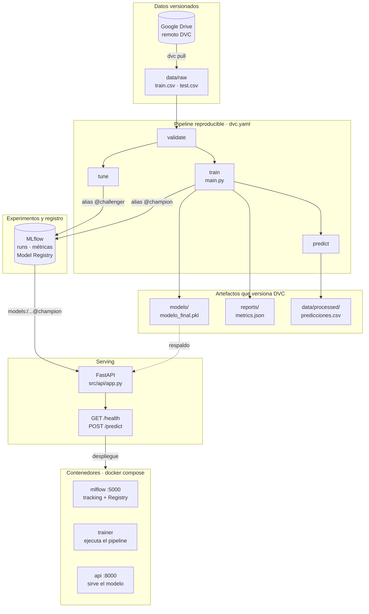

# Clasificación de precios de teléfonos

## Integrantes

1. Canaviri Yanahuaya Sergio Alexander
2. Hualca Yavi Lizbeth
3. Sanchez Calle Maria Yesica
4. Sotillo Sanchez Luis Antonio

La idea del proyecto es que dado un teléfono con sus 20
características técnicas, queremos saber en cuál de los cuatro rangos de precio
cae (`price_range`: 0, 1, 2 o 3). Lo que armamos alrededor de esa idea es lo que
convierte el ejercicio en un proyecto MLOps: el código está organizado en clases
reutilizables, hay pruebas automatizadas, DVC se encarga de los datos y los
artefactos, MLflow guarda los experimentos y registra los modelos, una API en
FastAPI sirve las predicciones y todo eso se levanta con contenedores.

## Arquitectura

Así viaja un dato desde el CSV crudo hasta el contenedor que responde
peticiones:



Git va el código y los punteros `.dvc`, y en Google
Drive los datos y los artefactos pesados. Algo que decidimos a propósito es no
hornear el modelo dentro de las imágenes; la API se lo pide al Model Registry
por alias, así que sirve siempre el último modelo promovido sin que tengamos que
reconstruir ni volver a desplegar nada.

El bloque de contenedores no es una etapa más del flujo: es el mismo flujo
empaquetado. `mlflow` se ocupa del tracking y el registro, `trainer` corre el
pipeline y `api` sirve el modelo. Los tres están descritos en
`docker-compose.yml`.

## Modelos

Comparamos tres modelos detrás de una misma interfaz, para que cambiar de uno a
otro no signifique tocar el resto del código:

- Regresión Logística, como línea base.
- Random Forest, para tener un ensamble y de paso mirar la importancia de las
  características.
- SVM, como alternativa no lineal.

El ganador se elige por `accuracy` sobre una división estratificada 80/20 con
`random_state=42`, y todos los parámetros salen de `params.yaml`, no de valores
sueltos en el código.

## Estructura

```text
data/                 Datos raw, interim, external y processed
docker/               Dockerfiles y requirements de cada imagen
docs/                 Documentación de arquitectura
models/               Modelo final administrado por DVC
notebooks/            EDA, entrenamiento y predicción
references/           Documentación del dataset
reports/              Métricas, validaciones y figuras
scripts/              Validación, predicción y búsqueda de hiperparámetros
src/api/              API de inferencia (FastAPI)
src/data/             Carga y preprocesamiento
src/features/         Construcción de características
src/models/           Modelos, evaluación, pipeline y tracking
tests/                Pruebas automatizadas
```

Es una variante de Cookiecutter Data Science, con los ajustes que se fueron agregando durante el desarrollo del proyeco.

## Instalación

En PowerShell:

```powershell
python -m venv .venv
.\.venv\Scripts\Activate.ps1
pip install -r requirements.txt
```

## DVC y Google Drive

En Git solo viven el código y los archivos puntero `.dvc`.
Los datasets, el modelo final y las predicciones se quedan en la caché de DVC y
en el remoto `gdrive_remote` de Google Drive.

Las credenciales OAuth van únicamente en `.dvc/config.local`, que está ignorado
por Git. Si estás montando el proyecto desde cero, configúralas así:

```powershell
dvc remote modify --local gdrive_remote gdrive_client_id "TU_CLIENT_ID"
dvc remote modify --local gdrive_remote gdrive_client_secret "TU_CLIENT_SECRET"
dvc pull
```

Los comandos del día a día:

```powershell
dvc pull          # descargar datos y artefactos
dvc repro         # reproducir las etapas modificadas
dvc metrics show  # consultar métricas
dvc status        # revisar el estado local
dvc status -c     # comparar caché local y remoto
dvc push          # subir artefactos nuevos a Google Drive
```

El pipeline de `dvc.yaml` tiene cuatro etapas:

1. `validate`: valida `train.csv` y `test.csv`.
2. `train`: compara los modelos base, elige el ganador y lo guarda.
3. `predict`: genera las predicciones del conjunto de prueba.
4. `tune`: corre la búsqueda de hiperparámetros con MLflow.

## MLflow

Todo el tracking está centralizado en `src/models/tracking.py`. Usamos SQLite en
local (`mlflow.db`) y el experimento `telefonos_price_classification`.

De cada ejecución hija guardamos:

- Parámetros y las métricas `accuracy`, `precision`, `recall` y `f1`.
- La matriz de confusión, en JSON y en PNG.
- El reporte de clasificación.
- El modelo, con su firma y un ejemplo de entrada.
- La rama y el commit de Git, más los hashes DVC de los datasets.

Y en cada ejecución padre queda una tabla y una gráfica comparativa, que al
final es lo que uno mira cuando quiere comparar de un vistazo. La etapa `tune`
hace exactamente seis ensayos: dos de Regresión Logística, dos de Random Forest
y dos de SVM. El ganador base se lleva el alias `champion` y el ganador de la
búsqueda el alias `challenger`, ambos sobre el modelo registrado
`TelefonosPriceClassifier`.

Si solo quieres esos seis ensayos:

```powershell
python -m scripts.tune_hyperparameters
```

Para levantar la interfaz web:

```powershell
mlflow server --backend-store-uri sqlite:///mlflow.db --host 127.0.0.1 --port 5000
```

Abre `http://127.0.0.1:5000` y entra en **Entrenamiento de modelos**. Ojo: la
base `mlflow.db`, `mlruns/` y `mlartifacts/` son locales y están ignorados por
Git.

Si defines `MLFLOW_TRACKING_URI`, esa variable manda sobre lo que diga
`params.yaml`, así que puedes apuntar a un servidor de tracking sin tocar el
repositorio. Tienes el ejemplo en `.env.example`.

## API de inferencia

La API sirve el modelo con alias `champion` del Model Registry. Si el Registry
no está disponible, cae al artefacto local `models/modelo_final.pkl`; la idea es
que nunca se quede inutilizable por depender de un servicio externo.

Para levantarla en local:

```powershell
uvicorn src.api.app:app --reload --port 8000
```

Los endpoints:

| Método  | Ruta         | Descripción                                                  |
| -------- | ------------ | ------------------------------------------------------------- |
| `GET`  | `/`        | Estado, modelo servido y features esperadas                   |
| `GET`  | `/health`  | Readiness: 200 si hay modelo cargado, 503 mientras no lo haya |
| `POST` | `/predict` | Predice el rango de precio de uno o varios teléfonos         |
| `GET`  | `/docs`    | Documentación interactiva que genera FastAPI                 |

`/health` es el que consulta el `HEALTHCHECK` del contenedor, y por eso
distingue entre *el proceso responde* y *el modelo está listo*: no son lo mismo.

Un ejemplo de petición, con el payload que ya está en el repositorio:

```powershell
curl -X POST http://localhost:8000/predict -H "Content-Type: application/json" -d "@tests/payload_ejemplo.json"
```

La respuesta trae, por cada fila, el código `price_range` (0 a 3), su etiqueta
legible, la confianza y el detalle de probabilidades por clase.

### Autenticación

`/predict` acepta autenticación opcional por API key. Se activa definiendo
`API_KEY` en `.env`; si no está o está vacía, queda desactivada, que es lo
cómodo para trabajar en local y para las pruebas. Cuando la clave está definida,
hay que mandar la cabecera:

```powershell
curl -X POST http://localhost:8000/predict -H "X-API-Key: TU_CLAVE" -H "Content-Type: application/json" -d "@tests/payload_ejemplo.json"
```

Desde `/docs` la clave se mete una sola vez en el botón **Authorize** de arriba
a la derecha. Sin eso, todos los `Try it out` de `/predict` responden 401
aunque el resto del payload sea correcto.

Dos detalles que cuestan un rato descubrir cuando la clave se rechaza sin
motivo aparente:

- Docker Compose lee `.env` al **crear** el contenedor, así que editar la clave
  no tiene efecto hasta recrearlo: `docker compose up -d --force-recreate api`.
- El valor se usa literal. Si se pega envuelto en los ángulos `< >` del
  generador de claves, o el `.env` está guardado en CRLF, la clave real
  incluye esos caracteres. La API avisa de ambos casos en el log al arrancar.

## Docker

El stack levanta tres servicios: `mlflow` (tracking y Model Registry), `api`
(inferencia) y `trainer`, que no arranca con `up` porque lo llamamos solo cuando
toca entrenar.

```powershell
docker compose build
docker compose up -d
```

Con eso ya tienes la API en `http://localhost:8000` y MLflow en
`http://localhost:5000`. La API arranca aunque todavía no exista un modelo: cae
al artefacto local y `/health` responde 503 hasta que lo haya, sin meterse en un
bucle de reinicios.

Para entrenar dentro del contenedor y recargar la API con el nuevo campeón:

```powershell
docker compose run --rm trainer
docker compose restart api
```

El `trainer` escribe el modelo y las métricas en el host por bind-mount, así que
DVC los sigue versionando desde fuera del contenedor. Esto nos dio guerra al
principio, hasta que el pipeline pasó a forzar LF en todas sus salidas: con eso
los hashes que produce Linux coinciden con los de Windows y `dvc status` sigue
limpio después de entrenar en Docker.

Otros comandos que usamos seguido:

```powershell
docker compose run --rm trainer python -m scripts.predict
docker compose ps
docker compose logs -f
docker compose down
```

Y el equivalente en `make`: `docker-build`, `docker-up`, `docker-train`,
`docker-predict`, `docker-ps`, `docker-logs`, `docker-down` y `docker-clean`.
Cuidado con el último, que borra también los volúmenes, es decir el historial de
MLflow del stack.

Una aclaración por si extraña: MLflow corre dentro del contenedor sobre su
propio volumen, con una base limpia. No reutilizamos el historial local del host
a propósito, porque sus artefactos apuntan a rutas `C:/Users/...` que no existen
en un contenedor Linux.

## Ejecución

El flujo reproducible completo:

```powershell
dvc pull
dvc repro
dvc metrics show
```

Si solo quieres el entrenamiento base, sin pasar por DVC:

```powershell
python main.py
```

Y los notebooks, en este orden:

1. `notebooks/01_eda.ipynb`
2. `notebooks/02_entrenamiento.ipynb`
3. `notebooks/03_prediccion.ipynb`

## Pruebas

```powershell
pytest
```

La suite pasa en un clon recién hecho, sin `dvc pull` y sin haber entrenado
nada: las pruebas de la API inyectan un modelo doble, y las que dependen de los
CSV se saltan solas con un mensaje que explica qué falta. Si ya descargaste los
datos y quieres exigir también esas:

```powershell
pytest -m datos
```
