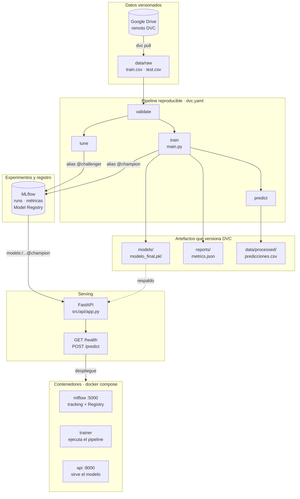

# Clasificación de precios de teléfonos

## Integrantes

1. Canaviri Yanahuaya Sergio Alexander
2. Hualca Yavi Lizbeth
3. Sanchez Calle Maria Yesica
4. Sotillo Sanchez Luis Antonio

Proyecto MLOps para clasificar teléfonos en cuatro rangos de precio
(`price_range`: 0, 1, 2 o 3) a partir de 20 características técnicas. Integra
una arquitectura orientada a objetos, pruebas automatizadas, DVC para datos y
artefactos, MLflow para experimentos y registro de modelos, una API de
inferencia sobre FastAPI y un stack de contenedores que une las tres piezas.

## Arquitectura

Del dato crudo al contenedor en producción:



Git conserva el código y los punteros `.dvc`; Google Drive, los datos y
artefactos. El modelo nunca se hornea en las imágenes: la API lo pide al Model
Registry por alias, de modo que sirve siempre el último promovido sin necesidad
de reconstruir ni desplegar nada.

El bloque de contenedores no es una etapa más del flujo, sino el mismo flujo
empaquetado: `mlflow` cubre el tracking y el registro, `trainer` ejecuta el
pipeline y `api` sirve el modelo. Los tres se describen en `docker-compose.yml`.

## Modelos

El proyecto utiliza una interfaz común para comparar:

- Regresión Logística como modelo base.
- Random Forest para modelos de ensamble e importancia de características.
- SVM como alternativa no lineal.

La selección se realiza por `accuracy` sobre una división estratificada 80/20
con `random_state=42`. Los parámetros se administran desde `params.yaml`.

## Estructura

```text
data/                 Datos raw, interim, external y processed
docker/               Dockerfiles y requirements de cada imagen
docs/                 Documentación de arquitectura
models/               Modelo final administrado por DVC
notebooks/            EDA, entrenamiento y predicción
references/           Documentación del dataset
reports/              Métricas, validaciones y figuras
scripts/              Validación, predicción y búsqueda de hiperparámetros
src/api/              API de inferencia (FastAPI)
src/data/             Carga y preprocesamiento
src/features/         Construcción de características
src/models/           Modelos, evaluación, pipeline y tracking
tests/                Pruebas automatizadas
```

Esta distribución sigue una variante de Cookiecutter Data Science.

## Instalación

En PowerShell:

```powershell
python -m venv .venv
.\.venv\Scripts\Activate.ps1
pip install -r requirements.txt
```

## DVC y Google Drive

Git conserva el código y los archivos puntero `.dvc`. Los datasets, el modelo
final y las predicciones se conservan en la caché DVC y en el remoto
`gdrive_remote` de Google Drive.

Las credenciales OAuth deben estar únicamente en `.dvc/config.local`, archivo
ignorado por Git. Para configurarlas en una instalación nueva:

```powershell
dvc remote modify --local gdrive_remote gdrive_client_id "TU_CLIENT_ID"
dvc remote modify --local gdrive_remote gdrive_client_secret "TU_CLIENT_SECRET"
dvc pull
```

Comandos principales:

```powershell
dvc pull          # descargar datos y artefactos
dvc repro         # reproducir las etapas modificadas
dvc metrics show  # consultar métricas
dvc status        # revisar el estado local
dvc status -c     # comparar caché local y remoto
dvc push          # subir artefactos nuevos a Google Drive
```

El pipeline definido en `dvc.yaml` contiene:

1. `validate`: valida `train.csv` y `test.csv`.
2. `train`: compara los modelos base, selecciona y persiste el ganador.
3. `predict`: genera las predicciones del conjunto de prueba.
4. `tune`: ejecuta la búsqueda de hiperparámetros con MLflow.

## MLflow

La implementación central está en `src/models/tracking.py`. Utiliza SQLite
local (`mlflow.db`) y el experimento `telefonos_price_classification`.

Cada ejecución hija registra:

- Parámetros y métricas `accuracy`, `precision`, `recall` y `f1`.
- Matriz de confusión en JSON y PNG.
- Reporte de clasificación.
- Modelo, firma y ejemplo de entrada.
- Rama y commit de Git, además de hashes DVC de los datasets.

Cada ejecución padre registra una tabla y una gráfica comparativa. La etapa
`tune` realiza exactamente dos entrenamientos de Regresión Logística, dos de
Random Forest y dos de SVM. El ganador base recibe el alias `champion` y el
ganador de la búsqueda recibe `challenger` en el modelo registrado
`TelefonosPriceClassifier`.

Ejecutar únicamente los seis ensayos:

```powershell
python -m scripts.tune_hyperparameters
```

Iniciar la interfaz web:

```powershell
mlflow server --backend-store-uri sqlite:///mlflow.db --host 127.0.0.1 --port 5000
```

Abrir `http://127.0.0.1:5000` y seleccionar **Entrenamiento de modelos**. La
base `mlflow.db`, `mlruns/` y `mlartifacts/` son locales y están ignorados por
Git.

La variable de entorno `MLFLOW_TRACKING_URI` tiene prioridad sobre
`params.yaml`, lo que permite apuntar a un servidor de tracking sin editar el
repositorio. Ver `.env.example`.

## API de inferencia

Sirve el modelo con alias `champion` del Model Registry. Si el Registry no está
disponible, cae al artefacto local `models/modelo_final.pkl`, de modo que la
API nunca queda inutilizable.

Levantar en local:

```powershell
uvicorn src.api.app:app --reload --port 8000
```

Endpoints:

| Método | Ruta       | Descripción                                                      |
| ------ | ---------- | ---------------------------------------------------------------- |
| `GET`  | `/`        | Estado, modelo servido y features esperadas                       |
| `GET`  | `/health`  | Readiness: 200 si hay modelo cargado, 503 mientras no lo haya     |
| `POST` | `/predict` | Predice el rango de precio de uno o varios teléfonos              |
| `GET`  | `/docs`    | Documentación interactiva que genera FastAPI                      |

`/health` es lo que consulta el `HEALTHCHECK` del contenedor, y por eso
distingue entre *el proceso responde* y *el modelo está listo*.

Ejemplo de petición, con el payload incluido en el repositorio:

```powershell
curl -X POST http://localhost:8000/predict -H "Content-Type: application/json" -d "@tests/payload_ejemplo.json"
```

La respuesta trae, por cada fila, el código `price_range` (0 a 3), su etiqueta
legible, la confianza y el detalle de probabilidades por clase.

### Autenticación

`/predict` admite autenticación opcional por API key. Se activa definiendo
`API_KEY` en `.env`; ausente o vacía, queda desactivada, que es lo cómodo en
local y en las pruebas. Con la clave definida hay que enviar la cabecera:

```powershell
curl -X POST http://localhost:8000/predict -H "X-API-Key: TU_CLAVE" -H "Content-Type: application/json" -d "@tests/payload_ejemplo.json"
```

## Docker

El stack levanta tres servicios: `mlflow` (tracking y Model Registry), `api`
(inferencia) y `trainer`, que no arranca con `up` porque se invoca a demanda.

```powershell
docker compose build
docker compose up -d
```

Con eso quedan disponibles la API en `http://localhost:8000` y MLflow en
`http://localhost:5000`. La API arranca aunque todavía no haya modelo: cae al
artefacto local y `/health` responde 503 hasta que lo haya, sin entrar en bucle
de reinicios.

Entrenar dentro del contenedor y recargar la API con el nuevo campeón:

```powershell
docker compose run --rm trainer
docker compose restart api
```

El `trainer` escribe el modelo y las métricas en el host mediante bind-mount,
así que DVC los sigue versionando desde fuera del contenedor. Como el pipeline
fuerza LF en todas sus salidas, los hashes que produce Linux coinciden con los
de Windows y `dvc status` sigue limpio tras entrenar en Docker.

Otros comandos:

```powershell
docker compose run --rm trainer python -m scripts.predict
docker compose ps
docker compose logs -f
docker compose down
```

El equivalente en `make`: `docker-build`, `docker-up`, `docker-train`,
`docker-predict`, `docker-ps`, `docker-logs`, `docker-down` y `docker-clean`.
Este último borra también los volúmenes, es decir el historial de MLflow del
stack.

MLflow corre dentro del contenedor sobre su propio volumen, con una base
limpia. El historial local del host no se reutiliza a propósito: sus artefactos
apuntan a rutas `C:/Users/...` que no existen en un contenedor Linux.

## Ejecución

Flujo reproducible completo:

```powershell
dvc pull
dvc repro
dvc metrics show
```

Ejecución directa del entrenamiento base:

```powershell
python main.py
```

Notebooks, en orden:

1. `notebooks/01_eda.ipynb`
2. `notebooks/02_entrenamiento.ipynb`
3. `notebooks/03_prediccion.ipynb`

## Pruebas

```powershell
pytest
```

La suite pasa en un clon recién hecho, sin `dvc pull` y sin haber entrenado
nada: las pruebas de la API inyectan un modelo doble y las que dependen de los
CSV se saltan solas con un mensaje que explica qué falta. Para exigir estas
últimas, una vez descargados los datos:

```powershell
pytest -m datos
```

## Seguridad

- No subir `.dvc/config.local`, `.env`, credenciales OAuth ni secretos. Los
  tres están en `.gitignore` y excluidos del contexto de build de Docker.
- No agregar directamente a Git los CSV, modelos, `mlflow.db` o artefactos.
- Actualizar los datos con `dvc add`, confirmar el puntero `.dvc` en Git y
  ejecutar `dvc push`.
- La `API_KEY` se define en `.env`, nunca en `docker-compose.yml` ni en
  `params.yaml`.
