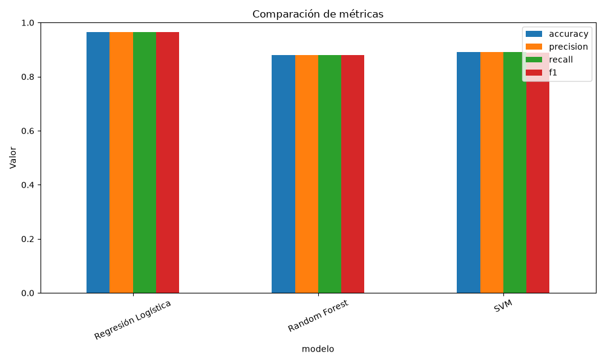
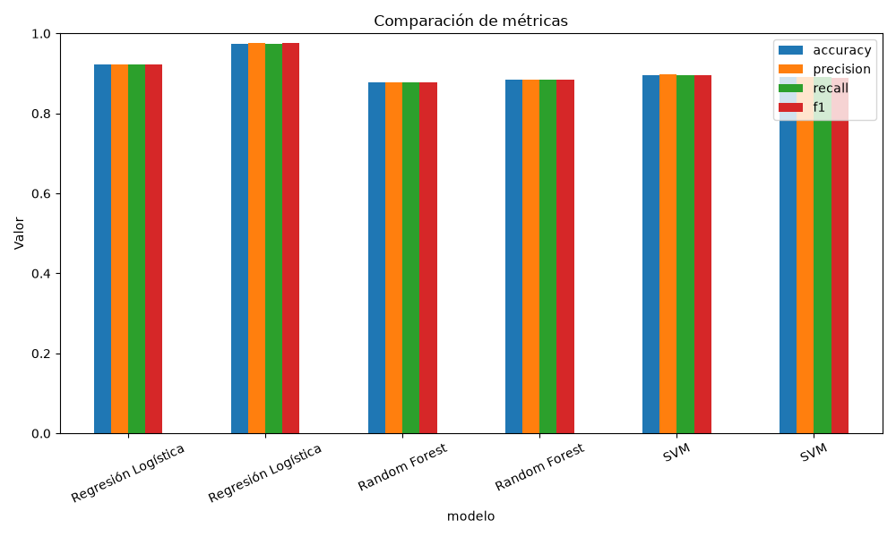
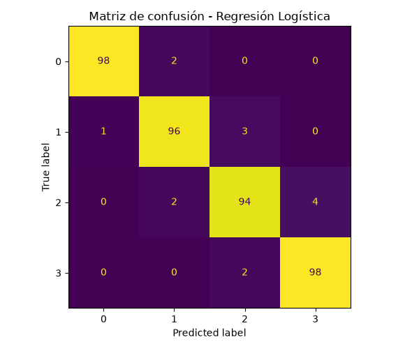

# Evidencia de MLflow

Este documento existe porque `mlflow.db`, `mlruns/` y `mlartifacts/` estan en
`.gitignore`: son bases y artefactos locales, con rutas absolutas que no
sobreviven a un clon. Sin algo asi, quien descargue el repositorio no tendria
forma de comprobar que el tracking funciona ni que hubo corridas de verdad.

Todo lo que sigue esta extraido de la base de tracking del proyecto, no
transcrito a mano. Las graficas son los artefactos que generaron esas mismas
corridas, copiados tal cual desde `mlruns/`.

Para reproducirlo desde cero:

```powershell
dvc repro                 # ejecuta las etapas train y tune, que loguean en MLflow
mlflow server --backend-store-uri sqlite:///mlflow.db --host 127.0.0.1 --port 5000
```

## Resumen

| Concepto | Valor |
| --- | --- |
| Servidor de tracking | `sqlite:///mlflow.db` (anclado a la raiz del repo por `src/config.py`) |
| Experimento | `telefonos_price_classification` (id `2`) |
| Corridas totales registradas | **44** |
| Modelo registrado | `TelefonosPriceClassifier` |
| Alias de produccion | `@champion` |
| Alias de la busqueda | `@challenger` |

El requisito pide evidencia de al menos dos corridas distintas. Aqui hay dos
flujos completos y diferentes entre si, cada uno con su corrida padre y sus
hijas anidadas:

- `comparacion_modelos`: entrena los tres modelos base y promueve el ganador a
  `@champion`. Lo lanza la etapa `train` de DVC (`python main.py`).
- `busqueda_hiperparametros`: seis ensayos, dos por familia de modelo, y
  promueve el ganador a `@challenger`. Lo lanza la etapa `tune`.

De cada corrida hija se guardan parametros, las cuatro metricas, la matriz de
confusion en JSON y en PNG, el reporte de clasificacion, el modelo con su firma
y un ejemplo de entrada, y el linaje: rama y commit de Git mas los hashes DVC
de los datasets. Ese linaje es el que aparece en las tablas de abajo y el que
permite atar una metrica concreta a un commit y a una version de los datos.

## Corridas

### Corrida padre `comparacion_modelos` — `f02dce6b`

- Tipo: `baseline`
- Linaje Git: commit `14a72b9`, rama `LuisS-integ-docker`
- Linaje DVC: `train.csv` md5 `e8c4560161dc3c8571b5b2db25be3294`
- Corridas hijas: 3

| Corrida hija | run_id | accuracy | precision | recall | f1 |
| --- | --- | ---: | ---: | ---: | ---: |
| `baseline_Regresión Logística` | `834acf9a` | 0.9650 | 0.9650 | 0.9650 | 0.9650 |
| `baseline_Random Forest` | `f2a8fa0f` | 0.8800 | 0.8805 | 0.8800 | 0.8802 |
| `baseline_SVM` | `fc548d50` | 0.8900 | 0.8903 | 0.8900 | 0.8899 |

### Corrida padre `busqueda_hiperparametros` — `1cfd28b9`

- Tipo: `hyperparameter_search`
- Linaje Git: commit `14a72b9`, rama `LuisS-integ-docker`
- Linaje DVC: `train.csv` md5 `e8c4560161dc3c8571b5b2db25be3294`
- Corridas hijas: 6

| Corrida hija | run_id | accuracy | precision | recall | f1 |
| --- | --- | ---: | ---: | ---: | ---: |
| `trial_1_Regresión Logística` | `ff3f434c` | 0.9225 | 0.9226 | 0.9225 | 0.9217 |
| `trial_2_Regresión Logística` | `0e4c9f23` | 0.9750 | 0.9752 | 0.9750 | 0.9750 |
| `trial_3_Random Forest` | `b024b284` | 0.8775 | 0.8776 | 0.8775 | 0.8774 |
| `trial_4_Random Forest` | `01a17c71` | 0.8850 | 0.8851 | 0.8850 | 0.8850 |
| `trial_5_SVM` | `dcde8daa` | 0.8950 | 0.8969 | 0.8950 | 0.8956 |
| `trial_6_SVM` | `3f694a98` | 0.8900 | 0.8903 | 0.8900 | 0.8899 |



*Grafica comparativa que la corrida padre `comparacion_modelos` registra como
artefacto en `graficas/comparacion_modelos.png`.*



*Los seis ensayos de la corrida `busqueda_hiperparametros`, con el mismo
formato para poder compararlos de un vistazo.*



*Matriz de confusion de la corrida promovida a `@champion`. Cada corrida hija
registra la suya.*

## Model Registry

Ninguna version se promueve a mano: `main.py` asigna `@champion` al ganador de
la comparacion y `scripts/tune_hyperparameters.py` asigna `@challenger` al
ganador de la busqueda. La API pide `models:/TelefonosPriceClassifier@champion`,
asi que sirve la ultima version promovida sin tocar codigo ni reconstruir la
imagen.

| Version | Alias | run_id de origen | Procedencia |
| ---: | --- | --- | --- |
| 1 | — | `241aa7d4` | baseline |
| 2 | — | `d3944402` | hyperparameter_search |
| 3 | — | `a0fde8a1` | baseline |
| 4 | — | `9ec63815` | hyperparameter_search |
| 5 | — | `5eb81ddd` | baseline |
| 6 | — | `095c6ec9` | hyperparameter_search |
| 7 | `@champion` | `834acf9a` | baseline |
| 8 | `@challenger` | `0e4c9f23` | hyperparameter_search |

## Comprobarlo en la interfaz

```powershell
mlflow server --backend-store-uri sqlite:///mlflow.db --host 127.0.0.1 --port 5000
```

En `http://127.0.0.1:5000`:

1. **Experiments** → `telefonos_price_classification`: las corridas padre con
   sus hijas anidadas y la columna `accuracy`.
2. Abrir cualquier hija: pestanas *Parameters*, *Metrics* y *Artifacts*, con
   `graficas/matriz_confusion.png` y `diagnosticos/clasificacion.json`.
3. **Models** → `TelefonosPriceClassifier`: las versiones y los aliases
   `@champion` y `@challenger` de la tabla anterior.
